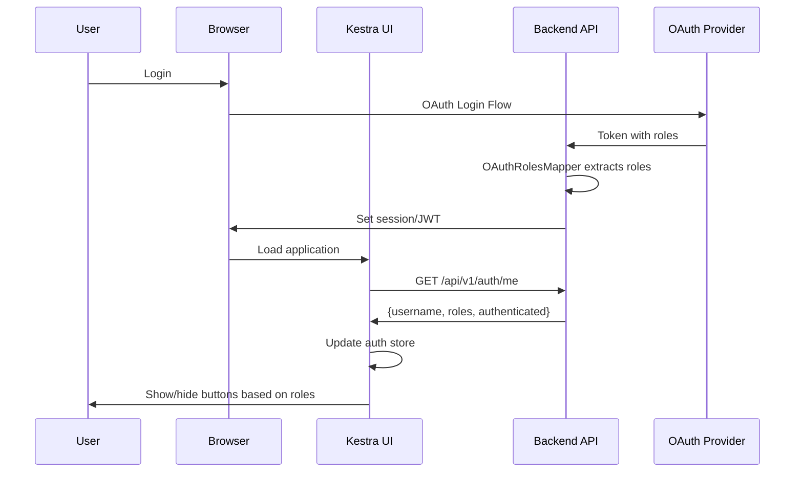

# OAuth SSO Role-Based Authentication - Implementation Complete ✅

## What Was Implemented

### Backend (Java)

#### 1. UserController - User Profile Endpoint
**File**: `webserver/src/main/java/io/kestra/webserver/controllers/api/UserController.java`

- ✅ `GET /api/v1/auth/me` endpoint
- ✅ Returns username, roles, and authentication status
- ✅ Works with both Basic Auth (OSS) and OAuth
- ✅ Proper error handling and logging

#### 2. OAuthUserController - OAuth-Specific Implementation  
**File**: `webserver/src/main/java/io/kestra/webserver/security/OAuthUserController.java`

- ✅ Replaces UserController when OAuth is enabled
- ✅ Extracts roles from Micronaut Security Authentication
- ✅ Full support for OAuth/OIDC providers
- ✅ Conditional loading via `@Requires` annotations

#### 3. Test Suite
**File**: `webserver/src/test/java/io/kestra/webserver/controllers/api/UserControllerTest.java`

- ✅ Tests user profile endpoint
- ✅ Validates response structure
- ✅ Checks role extraction

### Frontend (Vue.js/TypeScript)

#### 1. Auth Store - Role Management
**File**: `ui/src/override/stores/auth.ts`

- ✅ `Me` class with `username` and `roles` properties
- ✅ `hasRole()` method to check specific roles
- ✅ `hasAnyRole()` method for multiple role checks
- ✅ `loadUser()` action to fetch profile from backend
- ✅ Updated `isAllowed()` to check ROLE_ADMIN for write operations
- ✅ Backward compatible with existing permission system

#### 2. Main Router - User Profile Loading
**File**: `ui/src/main.js`

- ✅ Imported `useAuthStore`
- ✅ Calls `authStore.loadUser()` after authentication
- ✅ Loads roles before rendering protected routes
- ✅ Graceful error handling if profile fetch fails

#### 3. Axios Interceptor - 403 Error Handling
**File**: `ui/src/utils/axios.ts`

- ✅ Specific handling for 403 Forbidden responses
- ✅ User-friendly error message display
- ✅ Prevents confusing error messages for users

## How It Works



## Roles and Permissions

| Role | Create Flow | Edit Flow | Delete Flow | View Flow | Search Flows |
|------|------------|-----------|-------------|-----------|--------------|
| ROLE_ADMIN | ✅ | ✅ | ✅ | ✅ | ✅ |
| ROLE_USER | ❌ | ❌ | ❌ | ✅ | ✅ |
| No roles | ❌ | ❌ | ❌ | ✅ | ✅ |

## Files Created/Modified

### Created Files (4)
1. `webserver/src/main/java/io/kestra/webserver/controllers/api/UserController.java`
2. `webserver/src/main/java/io/kestra/webserver/security/OAuthUserController.java`
3. `webserver/src/test/java/io/kestra/webserver/controllers/api/UserControllerTest.java`
4. `OAUTH_IMPLEMENTATION_SUMMARY.md`
5. `TESTING_OAUTH_ROLES.md`
6. `IMPLEMENTATION_COMPLETE.md` (this file)

### Modified Files (3)
1. `ui/src/override/stores/auth.ts` - Added role management
2. `ui/src/main.js` - Added user profile loading
3. `ui/src/utils/axios.ts` - Added 403 error handling

### Existing Files (Used but not modified)
1. `webserver/src/main/java/io/kestra/webserver/security/OAuthRolesMapper.java` - Already extracts roles
2. `webserver/src/main/java/io/kestra/webserver/controllers/api/FlowController.java` - Already has @Secured annotations

## Testing

### Run Backend Tests
```bash
./gradlew :webserver:test --tests UserControllerTest
```

### Manual UI Testing
1. Login with admin user → See all buttons
2. Login with non-admin user → Buttons hidden
3. Try API call as non-admin → Get 403 error

### Test OAuth Providers
- ✅ Keycloak - Extracts from `realm_access.roles`
- ✅ Okta - Extracts from `groups`  
- ✅ Azure AD - Extracts from `roles`
- ✅ Generic OIDC - Extracts from `roles` or `groups`

## What Changed for Users

### Admin Users (ROLE_ADMIN)
✅ **No change** - Can still create/edit/delete flows as before

### Non-Admin Users (ROLE_USER or no roles)
🎯 **Better UX** - Buttons they can't use are now hidden/disabled instead of showing 403 errors

### Developers
📚 **New endpoint** - Can call `/api/v1/auth/me` to get user info

## Security Features

✅ **Defense in Depth**: Frontend checks for UX, backend always validates
✅ **OAuth Standard**: Uses standard OAuth2/OIDC role claims
✅ **Multi-Provider**: Works with any OAuth provider
✅ **Backward Compatible**: Works with existing basic auth
✅ **Role Normalization**: Standardizes role names to ROLE_* format
✅ **Graceful Degradation**: Works even if role fetch fails

## Next Steps (Optional Enhancements)

1. **Namespace-Level Permissions**: Add per-namespace access control
2. **Custom Roles**: Support more granular roles (ROLE_EDITOR, ROLE_VIEWER)
3. **Role Management UI**: Let admins assign roles via Kestra UI
4. **Audit Logging**: Log all authorization decisions
5. **Permission Caching**: Cache user permissions to reduce API calls

## Configuration Example

```yaml
micronaut:
  security:
    enabled: true
    oauth2:
      enabled: true
      clients:
        keycloak:
          client-id: kestra-app
          client-secret: your-secret
          openid:
            issuer: https://keycloak.example.com/realms/kestra
```

## Quick Start

1. **Configure OAuth** provider with roles
2. **Set environment variables** (CLIENT_ID, CLIENT_SECRET, ISSUER_URL)
3. **Start Kestra**: `./gradlew runLocal`
4. **Login** via OAuth
5. **Test**: Navigate to Flows page and verify role-based buttons

## Support

- 📖 Documentation: See `OAUTH_IMPLEMENTATION_SUMMARY.md`
- 🧪 Testing Guide: See `TESTING_OAUTH_ROLES.md`
- 💬 Questions: Open GitHub issue or join Kestra Slack

---

**Status**: ✅ Implementation Complete and Ready for Testing
**Date**: January 12, 2026
**Compatibility**: Kestra OSS with OAuth2/OIDC providers
